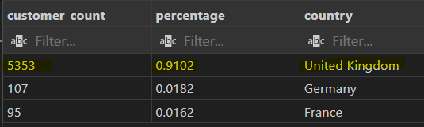
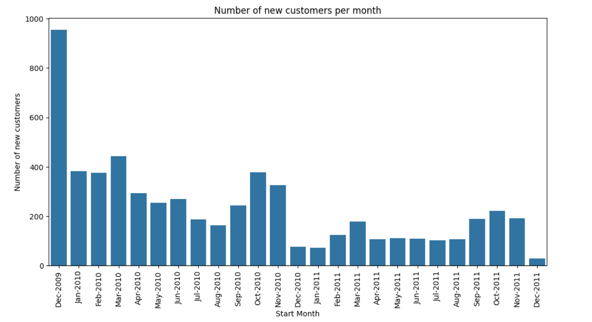
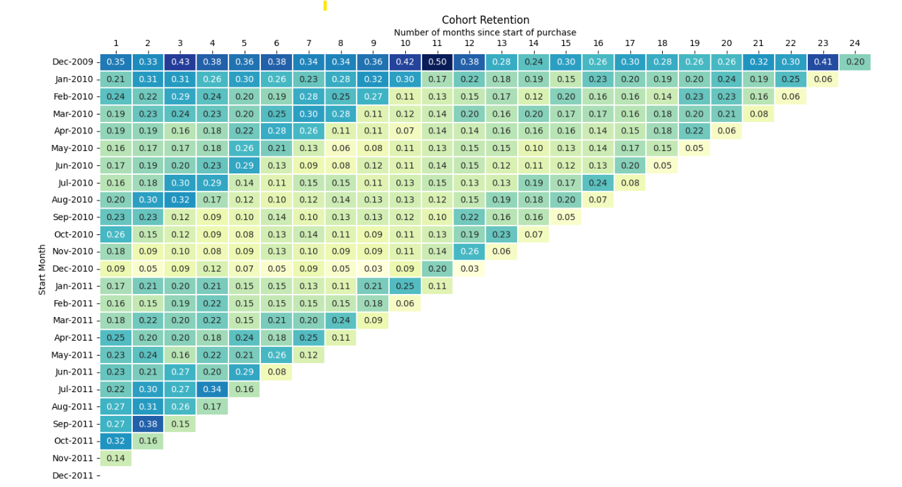
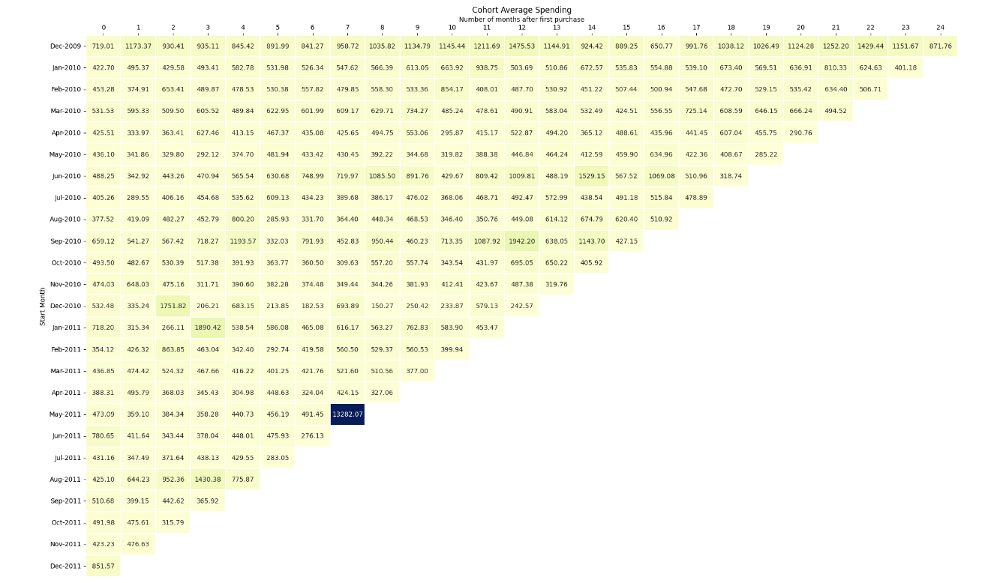
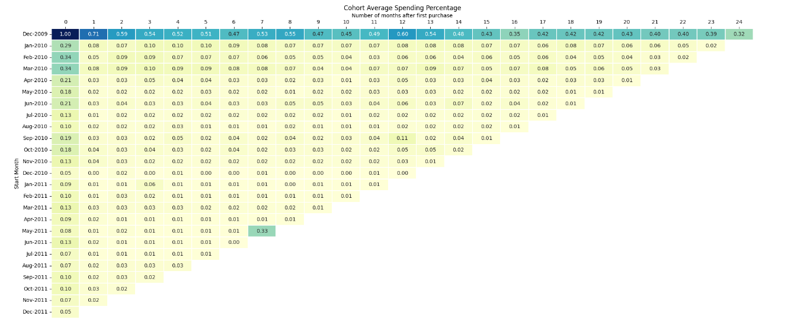
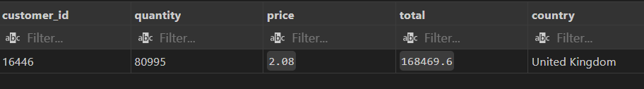
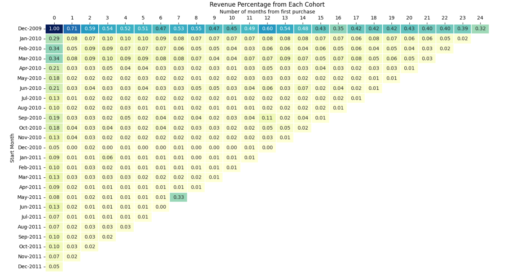

# Cohort Retention Analysis for a Small Online Retailer

## Business Problems

The retailer is a small business specializing in all-occasion gifts, primarily operating in the United Kingdom. In 2009, the company transitioned from a direct-mail catalog and phone order system to an online storefront. This analysis aims to understand the shopping behavior of new customers since the shift to e-commerce. By gaining insights into customer behavior, the retailer can optimize marketing strategies, enhance the shopping experience, and ensure that their product offerings align with the needs and preferences of their most valuable customers.

## Key Findings

Using SQL and python, I analyzed the [sales invoice data](https://www.kaggle.com/datasets/mashlyn/online-retail-ii-uci) from Dec 2009 to Dec 2011.

### 1. Customer Location Insight

Over 90% of the retailer’s customers based in the UK.

 

 ### 2. Monthly Trends in New Customer Acquisition

The number of new customers acquired has shown a declining trend over the past two years. 

Despite the overall decline, there is a notable increase in new customer acquisition in March and during the months leading up to Christmas (September, October, and November). 

### 3. Cohort Retention Analysis

Customers are segmented into cohorts based on the month they made their first online purchase. In this analysis, retention is defined as customers who continue to make purchases month after month.

- The first cohort, which began in December 2009, stands out as the most loyal, with over 20% of these customers still actively purchasing from the retailer over a two-year period. This group has demonstrated exceptional long-term retention.

- Retention rates have been relatively low for subsequent cohorts. 

- Retention rates typically increase in March and during the months leading up to Christmas, aligning with trends in new customer acquisition. 

### 4. Cohort Spending Analysis

The first cohort consistently spends significantly more on average than subsequent cohorts. This trend holds true across multiple months, including March, September, October, and November, where the rest of the cohorts continue to spend less than the first cohort.

A significant increase in spending was observed in the May 2011 cohort during December 2011. Upon closer examination, this spike was attributed to a substantial purchase made by a single customer.
This outlier highlights the potential influence of individual high-value customers on overall cohort performance.

### 5. Cohort Revenue Analysis

- The first cohort accounts for up to 40% of the retailer’s total revenue over a two-year period. This represents a significant portion of the company’s overall revenue, highlighting the importance of this cohort.
- In contrast, subsequent cohorts contribute considerably less to the retailer's revenue, indicating a strong reliance on the first cohort.

## Actionable Insights

1. Prioritize UK-Specific Holidays and Traditions

   -  Targeted Product Offerings: Focus on offering gifts that cater to UK-specific holidays and traditions. This approach aligns product offerings with customer preferences, potentially driving higher sales and customer satisfaction.

2. Enhance Promotional Strategies

   - Analyze and Compare: Review current promotional strategies and compare them with previous efforts to identify areas of improvement.
    - Revise and Innovate: Consider revising promotional approaches to attract more customers and boost overall sales.

3. Capitalize on Seasonal Trends

    - Strategic Marketing: Optimize marketing strategies in advance of peak periods (March, September, October, and November) to maximize revenue.
    - Consistent Customer Acquisition:Implement efforts to attract new customers consistently throughout the year, reducing reliance on seasonal spikes and ensuring balanced growth.

4. Enhance Customer Retention and Engagement

    - Targeted Campaigns: Develop marketing campaigns, loyalty programs, and personalized offers to boost spending and retention rates in later cohorts.
    - Retention Focus: Strengthen relationships with existing customers to increase lifetime value and repeat purchases.

5. Product and Service Alignment

    - Cohort Analysis: Analyze the purchasing behaviors and preferences of the first cohort to identify successful products or services. Promote these products to other cohorts to replicate success.

6. Customer Profiling

    - High-Spending Customers: Profile high-spending customers, such as those from the May 2011 cohort, to understand their preferences.
    - Tailored Offerings: Develop specific products, promotions, or loyalty programs aimed at converting these high-spending customers into regular, even more valuable customers.

7. Diversify Revenue Sources

     - Risk Mitigation: Explore strategies to increase revenue contribution from subsequent cohorts, reducing the retailer’s dependence on the first cohort and mitigating financial risk.

8. Customer Segmentation

     - Tailored Offerings: Segment customers within each cohort to create offerings that resonate with different segments, potentially increasing overall spending.

9. Continuous Monitoring and Adjustment

     - Revenue Distribution: Continuously monitor revenue contribution from each cohort and adjust strategies to ensure a more balanced revenue distribution over time.

## Methodology

1. `Panda` to explore, clean and prepare the data before loading it into SQL database.
2. Used `SQL` to identify cohorts based on the first purchase date of customers and analyze retention rate, revenue percentage and spending trend for each cohort.
3. `Matplotlib` and `Seaborn` to create bar graph on new customer acquisition and heatmap for cohort analysis

## Skills

SQL: View, CTE, JOINS, Aggregate functions

Python: Pandas, Matplotib, SeabornETL, data visualization

Data analysis

## References

1. Further reading on background of the retailer -  
[Data mining for the online
retail industry: A case study of
RFM model-based customer
segmentation using data mining](https://link.springer.com/content/pdf/10.1057/dbm.2012.17.pdf) 

2. Data set -
[Kaggel Online Retailer Sales Data](https://www.kaggle.com/datasets/mashlyn/online-retail-ii-uci) 

